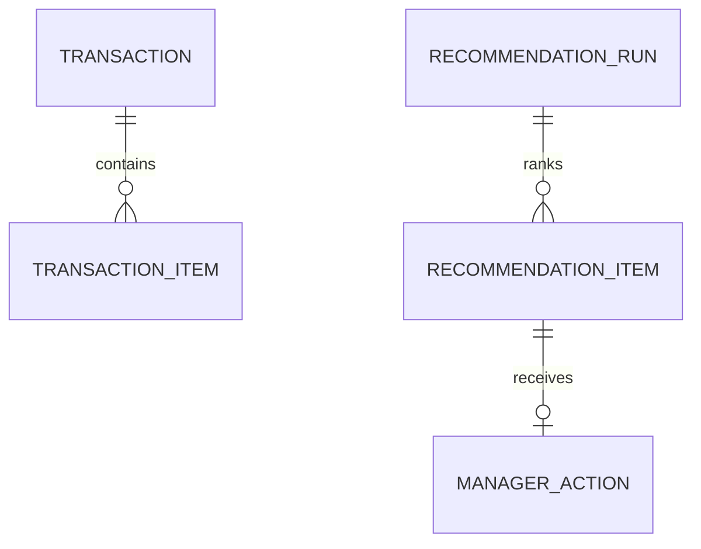

# ✨ feat: Expand POS log dashboard requirements for V1

## Overview
This plan updates the existing V1 direction by incorporating the additional requirements now listed in `docs/initial-plan.md` (KPI strip with deltas, best-sellers, category donut, hourly chart, suggestion card behavior, and transaction feed panel) while preserving the approved brainstorm boundaries.

The outcome is a clarified, implementation-ready spec that resolves scope conflicts and adds measurable acceptance criteria for dashboard behavior, data freshness, chart consistency, and recommendation transparency.

## Problem Statement
The original V1 plan is promo-first and deterministic, but `docs/initial-plan.md` now introduces richer dashboard requirements and mockup-driven expectations. Without a reconciliation pass, the team risks shipping mismatched behavior (for example, AI vs rule-based wording, or live feed expectations in a historical ingestion product).

## Proposed Solution
Adopt a **bounded expansion** strategy:
- Keep V1 constraints: single-store historical ingestion, deterministic recommendations, no LLM dependency.
- Add explicit dashboard module requirements from `docs/initial-plan.md:35`.
- Re-scope conflicting items to V1-safe versions:
  - "AI promotion suggestions" -> "Rule-based promotion suggestions"
  - "Live transaction feed" -> "Recent transactions panel from last processed batch"
- Define consistent filter and freshness contracts across KPI, charts, and recommendations.

## Technical Approach

### Architecture Alignment
- Reuse and extend existing module boundaries in:
  - `src/data/ingestion/*`
  - `src/analytics/*`
  - `src/recommendations/*`
  - `src/ui/dashboard/*`
  - `src/metrics/*`
- Add/extend UI view-model contracts so each mockup panel maps to explicit data fields and states.

### Implementation Phases

#### Phase 1: Scope Reconciliation and Spec Contracts
- Finalize V1 terminology and scope guardrails in docs.
- Publish chart/filter/freshness contract.
- Publish recommendation output contract (top N, rationale, exclusions, expected lift method).

Success criteria:
- No ambiguous "AI" or "live" wording remains in V1 docs.
- Every panel from `docs/initial-plan.md:37` has a documented data contract.

#### Phase 2: Dashboard Requirement Expansion
- Add/verify KPI strip deltas, best-sellers ranking, category donut inputs, hourly bins, and recent transaction panel behavior.
- Enforce deterministic ranking and tie-break rules across tables/charts/suggestions.
- Ensure all panels share one active filter context.

Success criteria:
- Panels render consistently for same time filter and same dataset.
- Hourly chart and day/week trend definitions are documented and testable.

#### Phase 3: Validation, Uplift, and UX Hardening
- Strengthen error/loading/empty/insufficient states across all major panels.
- Finalize uplift baseline/comparison definitions and caveats.
- Add tests for timezone, duplicate ingestion, and stale-data warnings.

Success criteria:
- End-to-end and contract tests pass for normal and edge scenarios.
- Manager-facing messaging is explicit for stale/insufficient data.

## Alternative Approaches Considered
- Keep prior plan unchanged: rejected because it leaves newly added requirements under-specified.
- Expand to true real-time + LLM now: rejected due to scope/risk mismatch with approved V1 boundaries.
- Full analytics workbench: rejected because it dilutes daily promo decision focus.

## Acceptance Criteria

### Functional Requirements
- [ ] V1 docs and UI use "Rule-based promotion suggestions" terminology; no LLM dependency in runtime path.
- [ ] Transaction panel is defined as **recent batch transactions** with last-refresh timestamp, not live stream.
- [ ] KPI strip includes revenue, transaction count, average basket, units sold, and documented day-over-day delta method.
- [ ] Best-sellers view supports chart + table outputs ranked by units with deterministic tie-breakers.
- [ ] Category breakdown supports chart + table outputs with clear primary metric (units or revenue) and percentage basis.
- [ ] Hourly quantity view is defined with explicit binning and store-local timezone behavior.
- [ ] Recommendation panel shows top 3-5 candidates, trigger rationale, exclusion reasons, and expected-lift methodology.
- [ ] Recommendation actions (accept/reject/defer) persist by business date and are available for uplift rollups.
- [ ] Filters/time windows apply consistently across KPI, charts, table views, recommendation panel, and uplift views.

### Non-Functional Requirements
- [ ] Data recency is always visible (`data as of`) and stale-data warning behavior is defined.
- [ ] Deterministic outputs: same input dataset + same rules version produce same recommendation order.
- [ ] Performance target documented for V1 datasets (for example, dashboard view-model generation under agreed threshold).
- [ ] Error handling includes row-level ingestion diagnostics and panel-specific recovery messaging.

### Quality Gates
- [ ] Update integration test coverage for expanded panel contracts and filter consistency.
- [ ] Add edge-case tests: duplicate signatures, zero baseline uplift, insufficient-history state, week/hour boundary behavior.
- [ ] Update docs references and examples to match final V1 terminology.

## Success Metrics
- Primary: promo uplift on accepted recommendations over defined baseline window.
- Secondary: manager action rate on recommendations (accepted/deferred/rejected).
- Secondary: time-to-decision from dashboard open to first recommendation action.

## Dependencies & Prerequisites
- Decision on minimum history threshold before recommendations are enabled.
- Decision on mandatory guardrails (margin floor and any stock/vendor constraints).
- Decision on KPI delta baseline definition and timezone policy.
- Alignment of mockup expectations with V1 historical architecture.

## Risk Analysis & Mitigation
- Risk: scope creep from "AI" and "live" wording.
  - Mitigation: explicit terminology and deferral notes in docs and UI labels.
- Risk: inconsistent interpretation across charts and tables.
  - Mitigation: shared filter contract and deterministic tie-break definitions.
- Risk: stale or low-quality data undermines trust.
  - Mitigation: recency banner, insufficient-data state, transparent exclusions.

## Documentation Plan
- Update or add:
  - `docs/specs/dashboard-panel-contracts.md`
  - `docs/specs/recommendation-rules.md` (terminology and expected-lift wording)
  - `docs/specs/data-freshness-and-filters.md`
  - `docs/specs/uplift-definition.md`

## ERD (No New Core Models Required)
The current logical entities from the prior V1 plan remain valid; this expansion clarifies behavior and contracts rather than introducing new domain entities.

## References & Research

### Internal References
- Brainstorm (authoritative WHAT): `docs/brainstorms/2026-05-01-pos-log-promo-intelligence-brainstorm.md:1`
- Added requirements and mockup intent: `docs/initial-plan.md:35`
- Existing V1 plan baseline: `docs/plans/2026-05-01-feat-pos-log-promo-intelligence-dashboard-v1-plan.md:1`
- Recommendation rules spec: `docs/specs/recommendation-rules.md:1`
- Dashboard renderer contract gap: `src/ui/dashboard/render.js:1`

### Research Findings
- No `docs/solutions/` institutional learnings directory currently exists.
- Spec-flow conflicts identified: AI wording and live-feed semantics vs approved V1 boundaries.
- Added requirement gaps identified: explicit chart/table dual mode, hourly behavior, filter consistency, and freshness UX.
