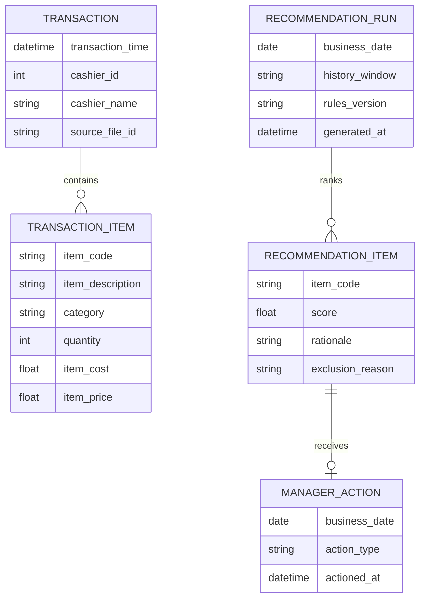

# ✨ feat: Add POS Log Promo Intelligence Dashboard V1

## Overview
Build a V1 dashboard for store managers that answers one daily question: what should we promote today? The feature ingests single-store historical POS logs (JSON/CSV mapped to canonical transaction schema), computes sales/margin trends, and outputs deterministic, rule-based promotion recommendations with clear rationale.

## Problem Statement / Motivation
Store managers currently lack a fast, repeatable workflow to translate raw transaction history into daily promotion decisions. Manual spreadsheet analysis is slow and inconsistent. V1 should reduce decision friction and increase promotion effectiveness by presenting ranked recommendations grounded in day/week and category/item performance plus margin guardrails.

## Proposed Solution
Deliver an action-first dashboard with three slices:
- Data onboarding and validation for JSON/CSV transaction logs.
- Analytics context (day/week trends, category and item performance, margin visibility).
- Rule-based recommendation panel with top-N items, rationale, exclusions, and manager action tracking (accept/reject/defer).

LLM generation is explicitly deferred for V1.

## Technical Considerations
- Architecture impacts: repo is docs-first with no app scaffold yet, so this plan must establish initial module boundaries and documentation conventions.
- Performance implications: pre-aggregate daily/weekly metrics after ingestion to keep dashboard rendering responsive for large historical files.
- Security considerations: no high-risk external integrations in V1; still protect margin-sensitive views and define manager-level access assumptions.
- Data integrity: strict schema validation and duplicate handling are required to avoid misleading recommendations.

## Acceptance Criteria
- [x] `src/data/ingestion/pos_importer.*` accepts JSON/CSV mapped to canonical schema from `docs/initial-plan.md:17` and rejects malformed records with row-level errors.
- [x] `src/data/ingestion/import_report.*` shows processed/rejected/duplicate counts and imported date range.
- [x] `src/analytics/aggregations.*` computes day/week item and category aggregates, including units, revenue, and gross margin.
- [x] `src/recommendations/rules_engine.*` returns deterministic top 5 promotion candidates with score and human-readable rationale.
- [x] `src/recommendations/guardrails.*` enforces mandatory exclusions (minimum margin floor, invalid/sparse data rules) and shows exclusion reasons.
- [x] `src/ui/dashboard/*` displays KPI cards, trend views, category breakdown, recommendation panel, and data-as-of timestamp.
- [x] `src/ui/recommendation_actions/*` supports accept/reject/defer actions and persists decision state by date.
- [x] `src/metrics/uplift_calculator.*` calculates promo uplift using defined baseline/comparison windows and only includes accepted recommendations by default.
- [x] `tests/integration/import_and_recommendation_flow.*` verifies end-to-end flow: import -> aggregate -> recommend -> action -> uplift.
- [x] `docs/specs/recommendation-rules.md` documents rule IDs, thresholds, tie-breakers, and guardrails.

## Success Metrics
- Primary: promo uplift percentage for accepted recommendations vs defined baseline period.
- Secondary: manager decision time reduction (time from dashboard open to action selection).
- Secondary: recommendation action rate (accepted/deferred/rejected distribution).

## Dependencies & Risks
- Dependency: clear canonical schema contract for required/optional fields and types.
- Dependency: decision on minimum historical window required before showing recommendations.
- Risk: poor data quality (missing timestamps, category drift, duplicate transactions) can reduce trust.
- Risk: recommendation volatility across short windows can cause inconsistent daily guidance.
- Mitigation: explicit insufficient-data state, guardrails, stable ranking tie-breakers, and transparent rationale.

## SpecFlow Gaps Incorporated
- Add explicit first-run flow: upload -> validation -> import report -> ready dashboard.
- Add insufficient-data state if history is below threshold.
- Add action loop states (new/actioned) and auditable manager feedback.
- Define uplift contract and recommendation reproducibility requirements.
- Include error/loading/empty states for every major panel.

## AI-Era Considerations
- AI tools may accelerate implementation; require explicit human review for rule correctness and metric math.
- Any AI-generated code in `src/recommendations/*` and `src/metrics/*` must have deterministic tests before merge.

## ERD (V1 Logical Model)

## References & Research
- Brainstorm context: `docs/brainstorms/2026-05-01-pos-log-promo-intelligence-brainstorm.md:1`
- Initial requirements and schema seed: `docs/initial-plan.md:3`
- Feature scope and margin/promo intent: `docs/initial-plan.md:7`
- Canonical transaction example: `docs/initial-plan.md:17`
- Spec-flow gaps addressed: task analysis from 2026-05-01 planning session
- Institutional learnings: no `docs/solutions/` directory currently exists; create as project matures

## Implementation Readiness Notes
- Decision needed before build: minimum history threshold (default proposal: 4 weeks).
- Decision needed before build: mandatory guardrails (default proposal: margin floor + sparse-data exclusion).
- Decision needed before build: uplift baseline window (default proposal: prior 2 weeks).
